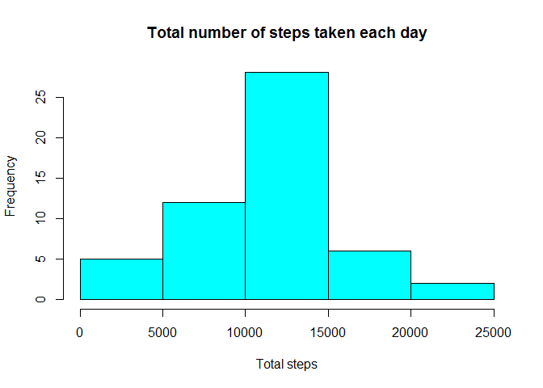
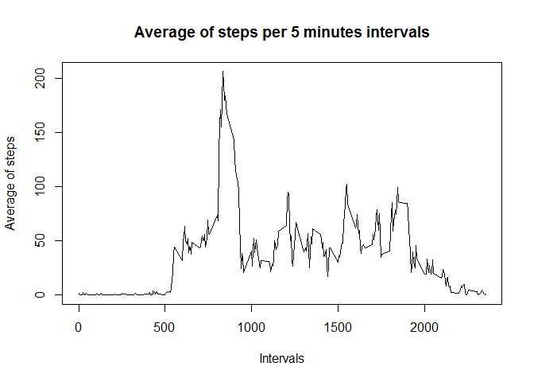
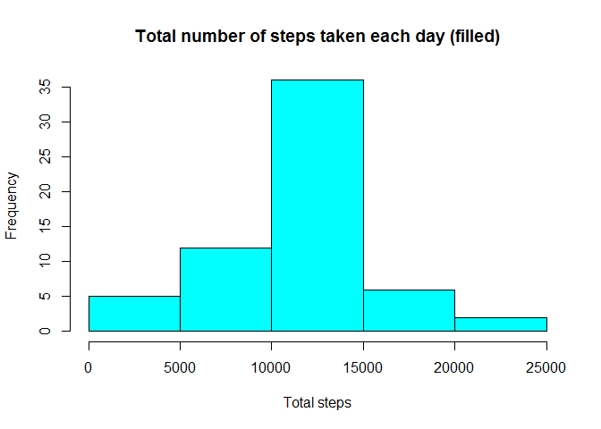
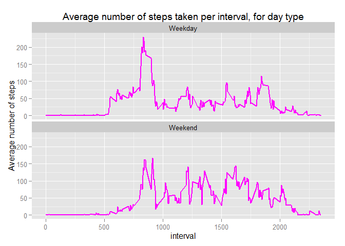

# Reproducible Research: Peer Assessment 1


## Loading and preprocessing the data


```r
# Set working directory, unzip and read activity csv file.
setwd("~/DataScienceSpecialization/ReproducibleResearch/RepData_PeerAssessment1")
unzip("activity.zip", exdir = "~/DataScienceSpecialization/ReproducibleResearch/RepData_PeerAssessment1")
activity <- read.csv("activity.csv")
# Convert date variable into Date class. 
activity$date <- as.Date(activity$date, "%Y-%m-%d")
```

## What is mean total number of steps taken per day?

Obtain the total number of steps per day and plot the histogram. 

```r
steps_per_day <- aggregate(steps ~ date, data = activity, FUN = sum)
hist(steps_per_day$steps, main = "Total number of steps taken each day", xlab = "Total steps", col = 5)
```



Calculate and report the mean and the median of total steps taken per day 

```r
mean(steps_per_day$steps)
```

```
## [1] 10766.19
```

```r
median(steps_per_day$steps)     
```

```
## [1] 10765
```

## What is the average daily activity pattern?

Obtain the mean of steps per interval for all days and construct the time series plot. 

```r
steps_per_interval <- aggregate(steps ~ interval, data = activity, FUN = mean)
plot(steps_per_interval$interval, steps_per_interval$steps, type = "l", main = "Average of steps per 5 minutes intervals", xlab = "Intervals", ylab = "Average of steps" )
```



Obtain the interval with the highest number of steps for all days 

```r
max_steps <- steps_per_interval$interval[which.max(steps_per_interval$steps)]
max_steps
```

```
## [1] 835
```

## Imputing missing values
Calculate and report missing values 

```r
sum(is.na(activity))
```

```
## [1] 2304
```

Filling missing values in steps taken with the mean of the 5-minutes interval for all days. 

```r
filling <- activity 
#Create a for function to check every row of the column steps.
for (i in 1:nrow(filling)){
      #If there is a missing value in that row,
      if(is.na(filling$steps[i])) {
            #look for the same row with the same interval number in steps_per_interval data frame. 
            cor_value <- which(filling$interval[i] == steps_per_interval$interval)
            #Fill the missing values row with the correspondant value of mean steps stored in the variable "cor_value". 
            filling$steps[i] <- steps_per_interval[cor_value,]$steps
      }
      
}
```

Plot a histogram of the total number of steps taken each day with the filled dataset. 

```r
steps_per_day_filled <- aggregate(steps ~ date, data = filling, FUN = sum)
hist(steps_per_day_filled$steps, main = "Total number of steps taken each day (filled)", xlab = "Total steps", col = 5)
```



Calculate and report the mean and median of the filled dataframe 

```r
mean(steps_per_day_filled$steps)
```

```
## [1] 10766.19
```

```r
median(steps_per_day_filled$steps)     
```

```
## [1] 10766.19
```

## Are there differences in activity patterns between weekdays and weekends?

Create a new "DayType" variable in the dataset and check in every row if is a weekday or a weekend, and change it's name to the corresponding one. 

```r
DayType <- weekdays(filling$date)
filling_with_days <- data.frame(filling, DayType, stringsAsFactors = FALSE)
for (i in 1:nrow(filling_with_days)){
                if(filling_with_days$DayType[i] == "Saturday" | filling_with_days$DayType[i] == "Sunday"){
      filling_with_days$DayType[i] =  "Weekend"
                }
      else {
            filling_with_days$DayType[i] =  "Weekday"
      }
}
```

Construct time series plots of the 5-minute interval and the average number of steps taken for all weekdays and all weekends. 

```r
library(ggplot2)
ggplot(data = filling_with_days, aes(interval, steps)) + stat_summary(fun.y = mean, geom = "line", col = 6 , size = 1) + facet_wrap(~DayType, nrow = 2) + ggtitle("Average number of steps taken per interval, for day type") + ylab("Average number of steps")
```


       
